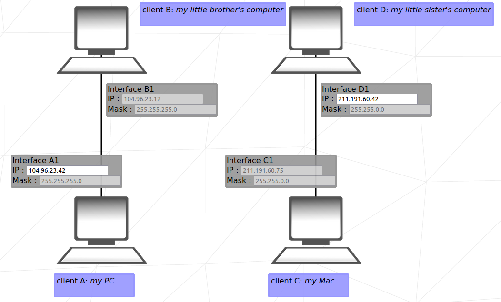

## 42 - NetPractice

This project serves as an introduction to the TCP/IP module, IP addressing, subnet masks, and routing. Within a training interface, participants are tasked with resolving networking errors across 10 levels.

