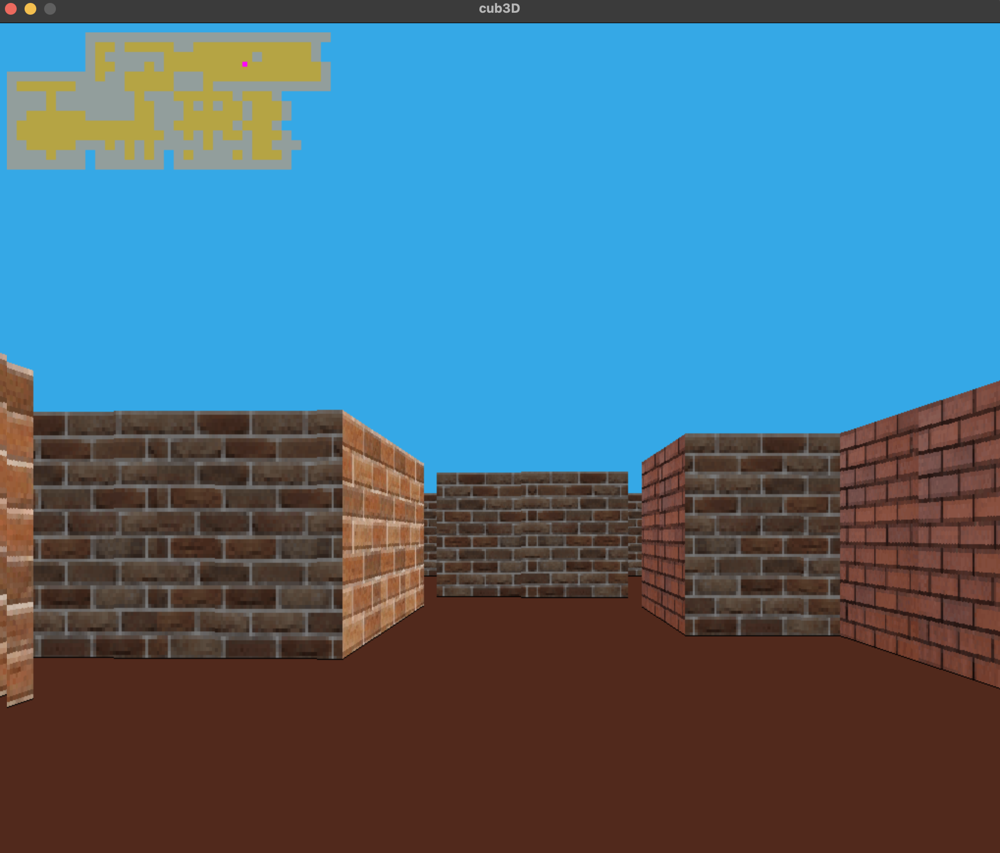

## 42 - Cub3D

This project is inspired by the world-famous eponymous 90’s game, Wolfenstein 3D. It consists to create a 3D perspective in a 2D map making use of Raycast rendering technique and Minilibx library.



## Usage
   ```
 make && ./cub3d maps/map.cub || maps/map1.cub || maps/map2.cub
   ```
